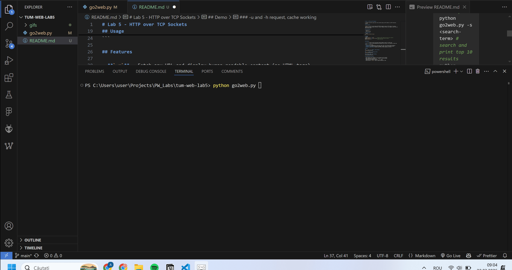
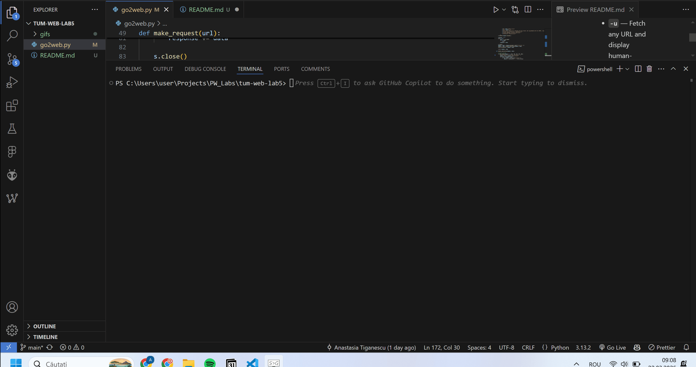
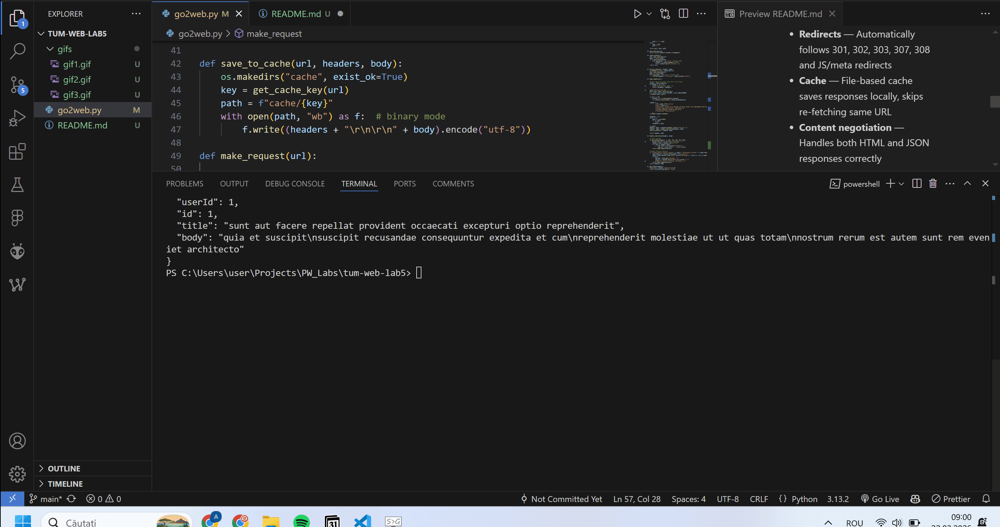

# Lab 5 - HTTP over TCP Sockets

A command line HTTP client built from scratch using raw TCP sockets — no HTTP libraries allowed.

## Description

`go2web` is a CLI tool that makes HTTP/HTTPS requests using raw TCP sockets. It parses responses manually, handles redirects, caches responses locally, and supports both HTML and JSON content types.

## Requirements

- Python 3.x
- BeautifulSoup4

## Installation
```bash
pip install beautifulsoup4
```

## Usage
```bash
python go2web.py -u <URL>         # make an HTTP request and print the response
python go2web.py -s <search-term> # search and print top 10 results  
python go2web.py -h               # show this help
```

## Features

- **`-u`** — Fetch any URL and display human-readable content (no HTML tags)
- **`-s`** — Search using DuckDuckGo and display top 10 results, with option to fetch any result
- **`-h`** — Show help
- **Redirects** — Automatically follows 301, 302, 303, 307, 308 and JS/meta redirects
- **Cache** — File-based cache saves responses locally, skips re-fetching same URL
- **Content negotiation** — Handles both HTML and JSON responses correctly

## Demo

### `-u` and `-h` request, cache working


### `-s` request, accessing results, redirection


### Fetching JSON, cache working


## Implementation Details

- HTTP requests built manually as raw strings over TCP sockets
- HTTPS supported via Python's `ssl` module to wrap the socket
- HTML parsed with BeautifulSoup4
- JSON parsed with Python's built-in `json` module
- Cache stored in `cache/` folder, keyed by MD5 hash of URL